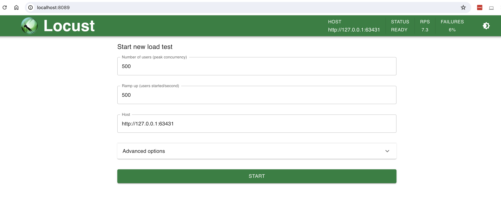

# Kubernetes Lab 2

In this lab we are practising how we can scale our app and load test it.
flask app is doing some obscure operation that is relatively expensive. This is so that we can load test it properly

```
def sum_of_squares(n):
    result = 0
    for i in range(1, n+1):
        result += i**2
    return result

@app.route('/')
def hello():
    return "hello!, result is " + str(sum_of_squares(1_000_000))
```

## Overall flow of deploying to k8s

Before this, you need to have your application containerize and by design, stateless.

1) Have a cluster running. In my case, it's Minikube.
2) Create deployment
3) Create service

## Specific steps
1) `kubectl apply -f app-deployment.yaml`
2) `kubectl apply -f service.yaml`
3) `minikube service my-app-service --url`
4) `locust -f locustfile.py --host=<minikub-url>`


5) Scale your application! Lets bring it up to 3
```
(base) ➜  ~ kubectl scale --replicas=3 deployment/my-app

deployment.apps/my-app scaled
(base) ➜  ~ kubectl get pods
NAME                      READY   STATUS    RESTARTS   AGE
my-app-55dfd7b9bb-dc8zg   1/1     Running   0          13m
my-app-55dfd7b9bb-jctmz   1/1     Running   0          6s
my-app-55dfd7b9bb-z48bc   1/1     Running   0          6s
```
6) Observe the performance. We can see the failure rate dropped from 94% to 59%. You can play with the scale command to see how the performance react.


## Clean up
1) `kubectl delete service my-app-service`
2) `kubectl delete deployment my-app`
